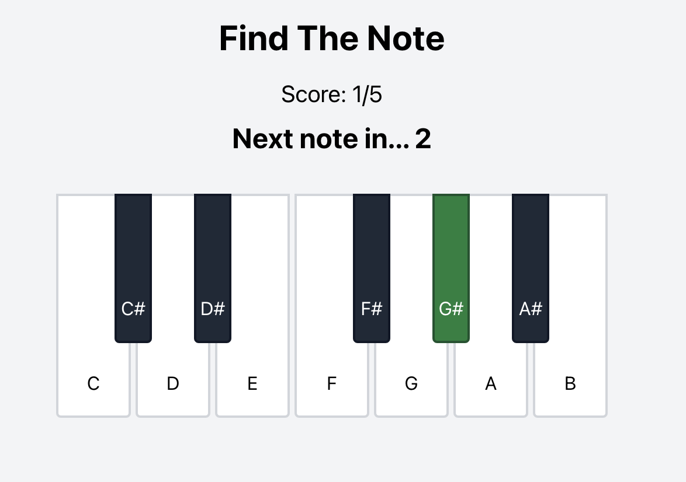
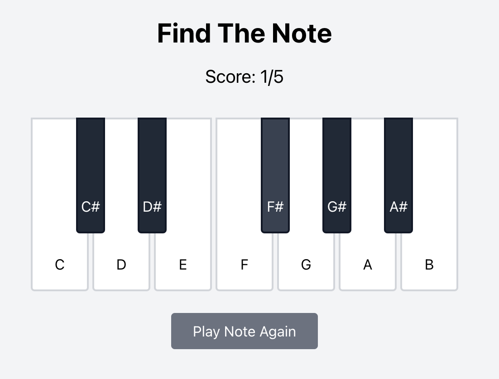
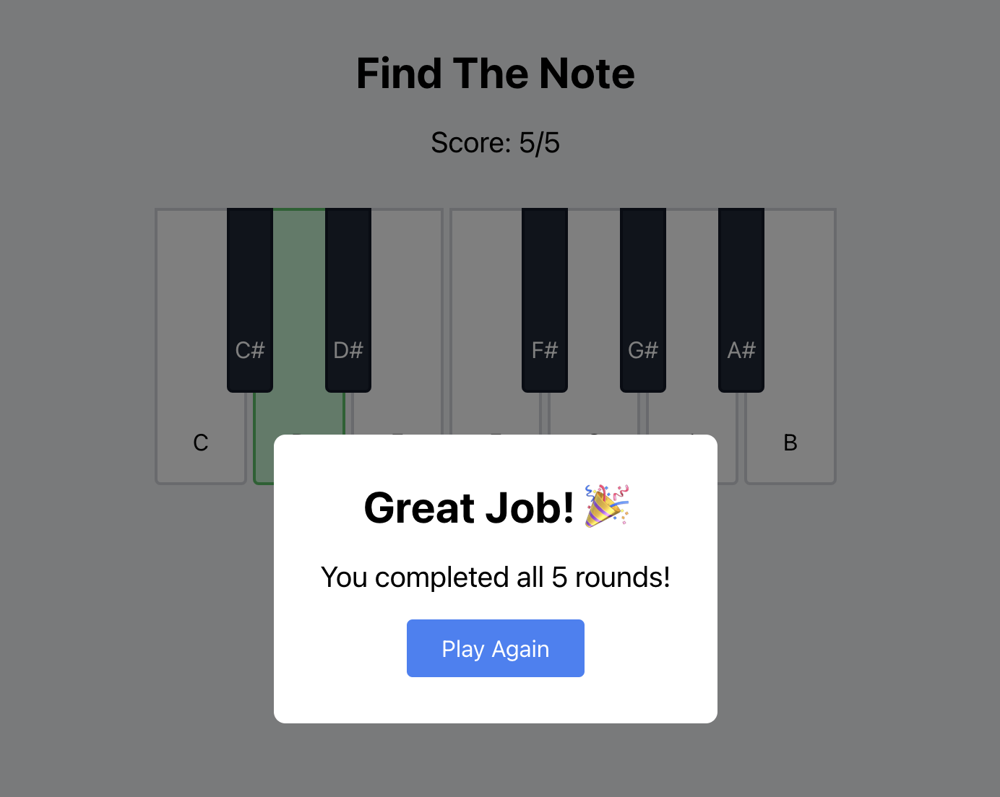

# Hack Technology / Project Attempted
Tech: React, Tone.js
Project Name: Find The Note

## What you built? 
My main semester-long project idea is to build a Music Theory Learning Module. This would be similar to Duolingo's approach but specialized for introductory music theory  for those without any musical background. 

For this hack-a-thing assignment, I got my hands dirty in creating a small web-app, focusing on the React technology and and Tone.js for the musical component. My initial idea is to create a playable mini-piano with keys, and guessing the audio note by selecting the correct key. The goal is for the user to gain perfect pitch by practicing this game multiple times!

**MAKE SURE TO HAVE AUDIO ON!**
### To run the program:
1) ```cd``` into **piano-trainer/**
2) type ```npm start```








## Who Did What?
I worked solo on the entire project

## Authors
- Brian Chun Yin Ng
